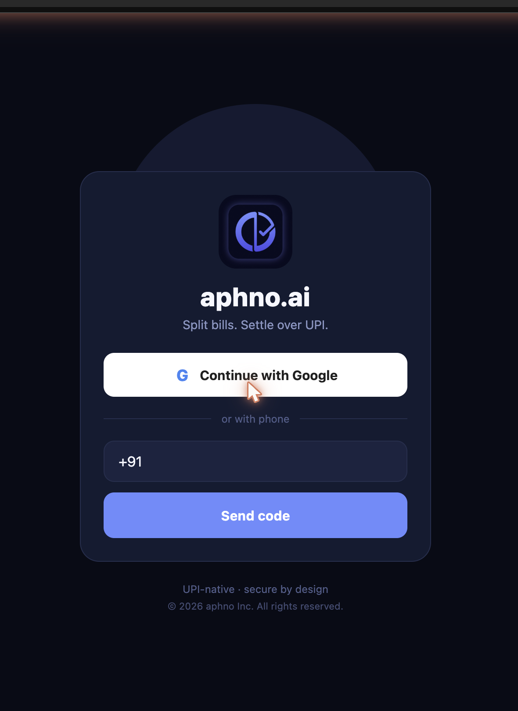
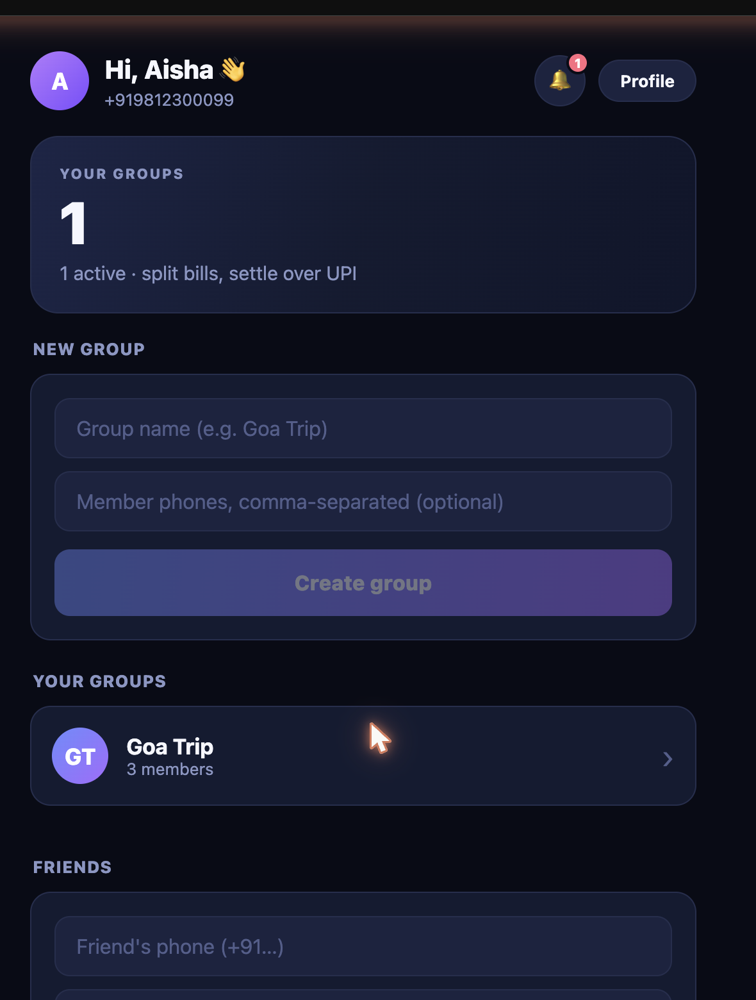
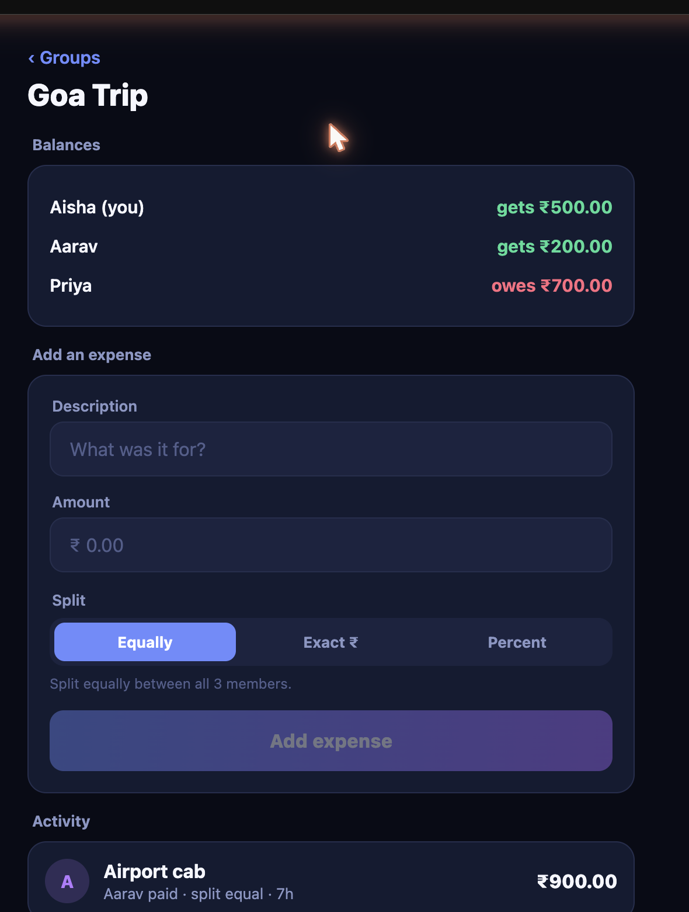
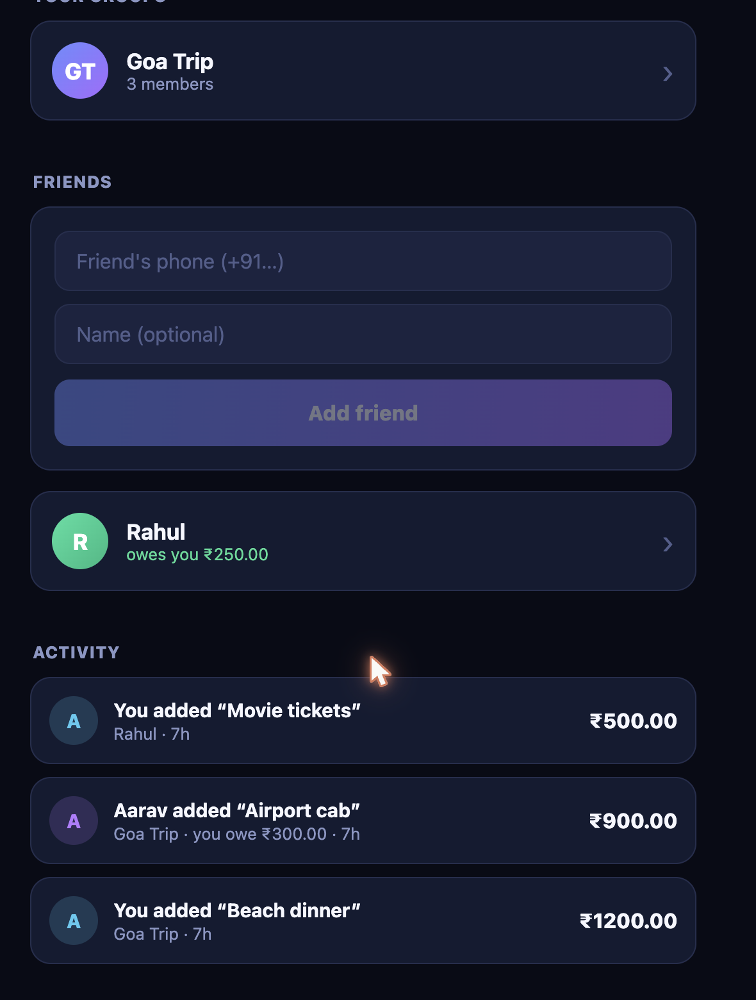
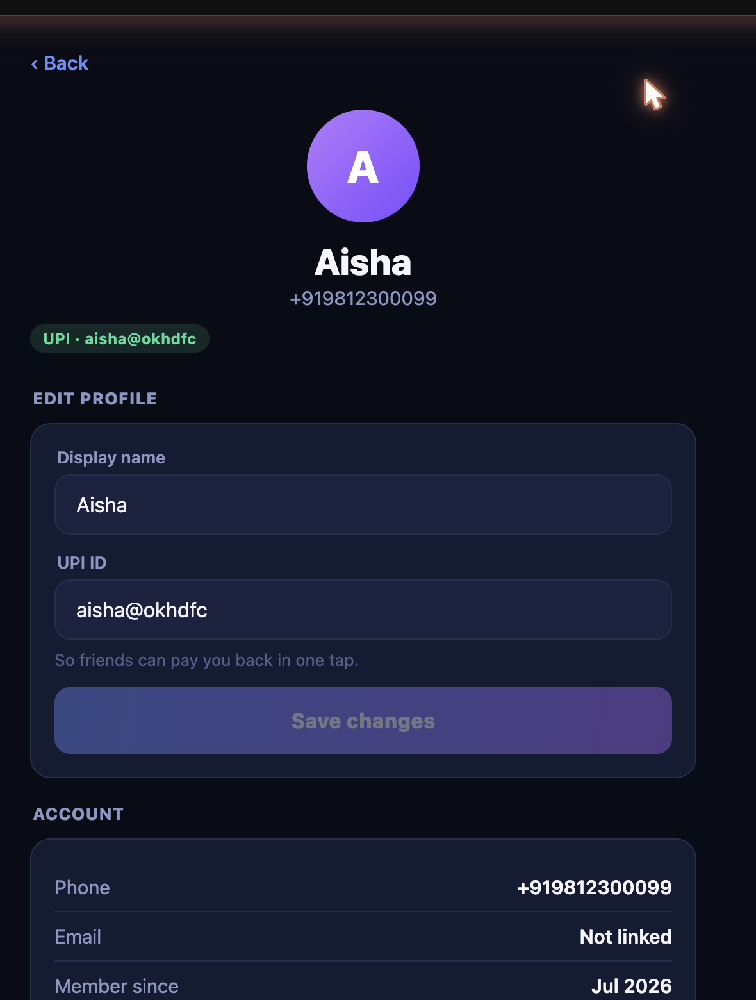

# aphno.ai

**UPI-native expense splitting for India.** Split bills in groups or 1-on-1, let
the app figure out who owes whom (in the fewest payments), and settle up in one
tap over UPI — with real-time notifications the moment anything changes.

One **Expo (React Native)** codebase runs as a **web app**, an **iOS app**, and an
**Android app**; a **Fastify + Prisma** API backs them, with a **WebSocket** channel
for live updates.

---

## Screenshots

|              Login              |             Home              |                Group ledger                |
| :-----------------------------: | :---------------------------: | :----------------------------------------: |
|  |  |      |
|       Phone OTP + Google        | Groups, friends & a live feed | Balances + `EQUAL`/`EXACT`/`PERCENT` split |

|                    Friends & activity                     |                  Notifications                  |               Profile               |
| :-------------------------------------------------------: | :---------------------------------------------: | :---------------------------------: |
|  |  |  |
|             1-on-1 balances + activity stream             |            In-app inbox (real-time)             |            Name + UPI ID            |

---

## Features

### Money & splitting

- **Groups** — create groups, add members by phone (unknown numbers become stub
  users you can invite later).
- **Friends (1-on-1)** — split directly with a person, no group needed. Each
  friendship is its own running ledger.
- **Flexible splits** — `EQUAL`, `EXACT` (₹ per person), or `PERCENT`, with **live
  validation** (balanced / X left / over by X) as you type. Amounts are stored as
  **integer paise**, so shares always sum exactly — no rounding drift.
- **Edit & delete** expenses (soft-delete, keeps balances honest).
- **Balances** — net position per member, plus a **minimal set of settle-up
  transfers** (debt simplification via min-cash-flow).
- **⚡ Smart settle-up** — shows how many back-and-forth IOUs were collapsed
  ("minimized N → M payments") so the group clears in the fewest taps.

### Settle over UPI

- **One-tap settle** — record a payment and get a `upi://pay?…` deep link that
  launches GPay / PhonePe / Paytm with the payee + amount **prefilled**; the debt
  is marked settled on return.

### Real-time & activity

- **Global activity feed** — one stream of every expense + settlement across all
  your groups and friends, newest first.
- **In-app notifications** — a 🔔 inbox with an unread badge; you're notified when
  someone adds an expense you're in, edits one, or pays you.
- **Live over WebSockets** — the bell and feed update the instant something
  happens; no refresh, no polling.

### Auth & profile

- **Phone OTP** — 6-digit code delivered over **WhatsApp** (preferred, India-
  friendly) → **SMS** (Twilio) → dev-log, whichever is configured.
- **Google sign-in** — verified ID token, one-tap login on web.
- **Profile** — display name and **UPI ID** (validated), so friends can pay you back
  in one tap.

---

## End-to-end flow

1. **Sign in** — phone OTP or "Continue with Google".
2. **Home** — a hero summary, your **groups**, your **friends**, and a live
   **activity feed**; a 🔔 bell shows unread notifications.
3. **Start splitting** — create a group (`Goa Trip`) or add a friend by phone.
4. **Add an expense** — pick who paid and how it splits (equally / exact ₹ /
   percent); the form validates the split live and creates it.
5. **See balances** — each person's net, and **smart settle-up** minimizes the
   transfers ("3 IOUs → 2 payments").
6. **Settle** — tap **Pay via UPI** → your UPI app opens with everything prefilled
   → the debt zeroes out.
7. **Everyone stays in sync** — the other people get a **real-time notification**
   and the activity feed updates live.

---

## Architecture

A TypeScript **pnpm + Turborepo** monorepo:

```
apps/
  api/       Fastify API — layered as DTO → repository → service → controller
             auth · users · groups · friends · expenses · settlements ·
             balances · feed · notifications · WebSocket
  mobile/    Expo app (web + iOS + Android) — one codebase, all three targets
packages/
  db/        Prisma schema, migrations, generated client (Postgres / Neon)
  shared/    Zod DTOs + types shared by the API and the app (one source of truth)
```

**Backend** — Fastify 5 + `fastify-type-provider-zod` (request/response validated by
the same Zod schemas the client uses), Prisma over Neon Postgres, a custom HS256
JWT, and `@fastify/websocket` for the real-time channel. New domains follow a clean
**DTO → repository → service → controller** layering.

**Frontend** — Expo / React Native with a custom design system (gradient CTAs,
avatars, segmented controls), TanStack Query for data + cache, and a `useRealtime`
hook that keeps a WebSocket open and refreshes the feed/notifications on each event.

**One 1-on-1 is a 2-person group under the hood**, so the entire
expense/split/balance/settlement/notification stack is reused for friends with no
duplicated logic.

---

## Prerequisites

- Node.js **≥ 20.10**, pnpm **9** (`corepack enable`)
- A PostgreSQL database ([Neon](https://neon.tech) recommended)

## Setup

```bash
pnpm install

# Env files (see each package's .env.example):
#   apps/api/.env       DATABASE_URL, JWT_SECRET, PORT=4000,
#                       (optional) WHATSAPP_* / TWILIO_* / GOOGLE_CLIENT_ID / ANTHROPIC_API_KEY
#   packages/db/.env    DATABASE_URL, DIRECT_URL   (Prisma migrations)
#   apps/mobile/.env    EXPO_PUBLIC_API_URL=http://localhost:4000
#                       EXPO_PUBLIC_GOOGLE_CLIENT_ID=<web oauth client id>

pnpm --filter @aphno/db exec prisma migrate deploy   # apply migrations
```

## Run locally

**1. Start the API** — Fastify on **http://localhost:4000**:

```bash
pnpm --filter @aphno/api dev
```

Interactive **Swagger UI** (every endpoint, try-it-out): **http://localhost:4000/docs**
· health check: **http://localhost:4000/v1/health** · WebSocket: `ws://localhost:4000/v1/ws`

**2. Run the app** — pick a target:

```bash
pnpm --filter @aphno/mobile web     # web build   → http://localhost:8081
pnpm --filter @aphno/mobile start   # phone (Expo Go) — scan the QR code
pnpm --filter @aphno/mobile ios     # iOS simulator
pnpm --filter @aphno/mobile android # Android emulator
```

> **Logging in dev:** no SMS/WhatsApp/Google setup needed — the OTP code is
> returned and shown **in-app** (`devCode`). Enter any `+91…` number → the code
> appears → verify.
>
> **On a physical device:** set `EXPO_PUBLIC_API_URL` to your machine's LAN IP
> (e.g. `http://192.168.0.98:4000`) — a device can't reach `localhost`.

**Everything at once:** `pnpm dev` (all `dev` tasks via Turborepo).
**Tests & types:** `pnpm test` (Vitest — money math, split allocation, JWT/OTP) ·
`pnpm typecheck` (tsc across all packages).

## Build a downloadable app (EAS)

```bash
cd apps/mobile
npx eas-cli build --platform android --profile preview   # installable .apk
npx eas-cli build --platform ios     --profile preview   # .ipa (needs Apple account)
```

## Deploy

- **API** → Railway (Docker; runs `prisma migrate deploy` on boot)
- **Web** → Vercel (static Expo web export)
- **Mobile** → EAS build

Full walkthrough (env vars, Google OAuth, WhatsApp OTP): [`infra/DEPLOY.md`](infra/DEPLOY.md).

## API overview

All routes live under `/v1`, documented interactively at `/docs`.

| Area          | Endpoints                                                                                                |
| ------------- | -------------------------------------------------------------------------------------------------------- |
| Auth          | `POST /auth/otp/request`, `POST /auth/otp/verify`, `POST /auth/google`                                   |
| Users         | `GET /users/me`, `PATCH /users/me`                                                                       |
| Groups        | `POST /groups`, `GET /groups`, `GET /groups/:id`, `POST /groups/:id/members`, `GET /groups/:id/balances` |
| Friends       | `GET /friends`, `POST /friends`                                                                          |
| Expenses      | `POST /groups/:id/expenses`, `GET /groups/:id/expenses`, `PATCH /expenses/:id`, `DELETE /expenses/:id`   |
| Settlements   | `POST /groups/:id/settlements`, `POST /settlements/:id/complete`, `GET /groups/:id/settlements`          |
| Feed          | `GET /feed`                                                                                              |
| Notifications | `GET /notifications`, `POST /notifications/read`                                                         |
| Real-time     | `GET /ws` (WebSocket — authenticate with an `auth` message)                                              |
